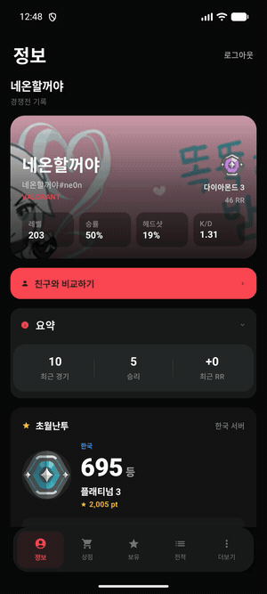
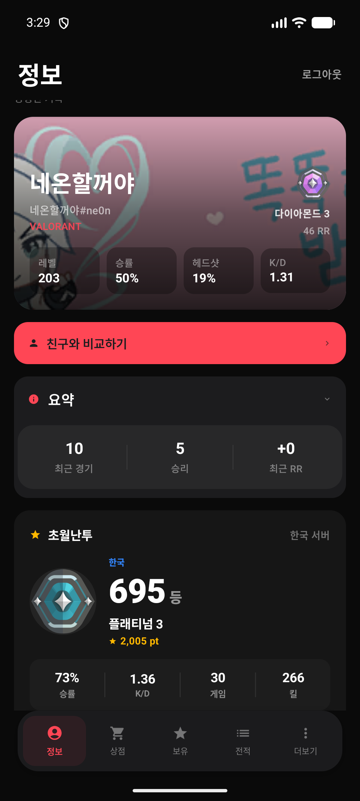
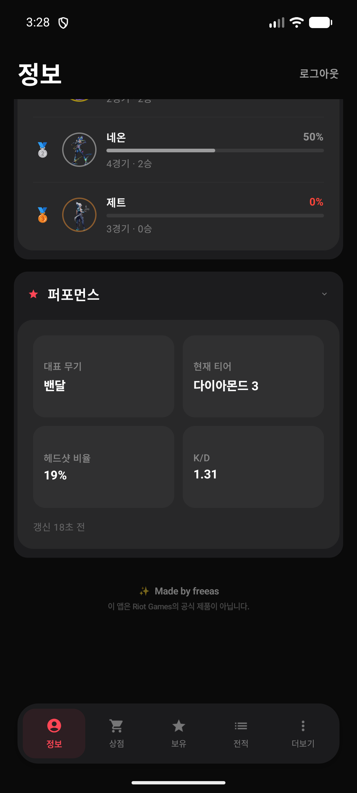
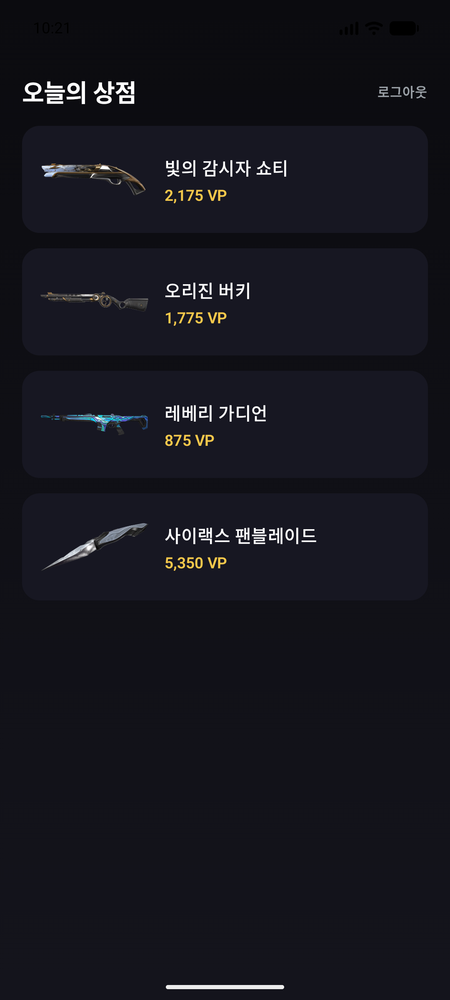
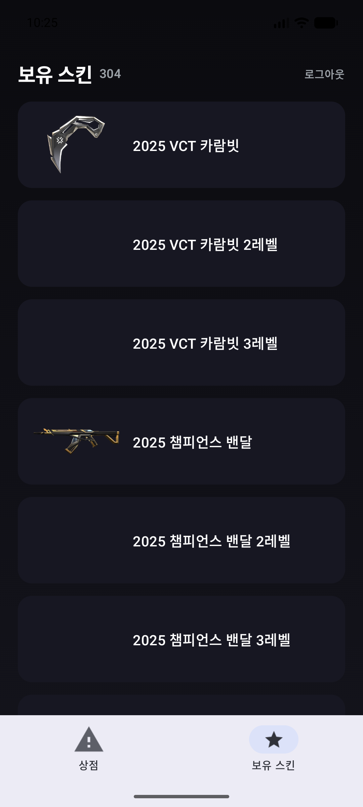

# 📲 Vely 갤럭시(안드로이드) 설치 가이드

### 발로란트 컴패니언 앱 **Vely** — 안드로이드 APK 설치법

설치하면 이렇게 작동합니다 — 정보(전적) 탭 · 상점 · 보유 · 전적

---

## ⚡ 빠른 설치 (3단계)

| 단계 | 할 일 |
|:---:|:---|
| **1** | 받은 **`vely.apk`** 파일을 폰에서 탭 |
| **2** | "**이 출처 허용**" 켜기 (알 수 없는 앱 설치 허용) |
| **3** | **설치** → **열기** → Riot 계정 로그인 |

> 요구사항: **Android 9 이상** · **Riot Games 계정 (KR)** · 약 **150MB** 저장공간 · `arm64` 기기(2017년 이후 대부분)

---

## 📋 자세한 설치 방법

### 1️⃣ APK 파일 받기
- 배포자에게 받은 **`vely.apk`** 를 폰의 **다운로드 폴더**에 저장합니다.
- 카톡/메일/링크로 받았다면 파일을 폰에 먼저 내려받으세요.

### 2️⃣ '알 수 없는 앱 설치' 허용
1. APK를 탭하면 **"보안상의 이유로 설치할 수 없음"** 안내가 뜹니다.
2. **설정** 버튼 → 파일을 연 앱(파일/내 파일/Chrome 등)의 **"이 출처에서 허용"** 을 **켭니다**.
   > 수동 경로: **설정 → 앱 → 특별한 앱 액세스 → 알 수 없는 앱 설치 → (해당 앱) → 허용**
3. 뒤로 가서 다시 설치를 누릅니다.

### 3️⃣ 설치 & 실행
1. **설치** → 잠시 후 **열기**.
2. **"Riot 계정으로 로그인"** → Riot 공식 로그인 창에서 로그인.
3. 로그인되면 **정보 탭**(전적)에 랭크·통계가 표시됩니다. 하단 탭으로 **상점 / 보유 / 전적 / 더보기** 이동.

---

## 🖼️ 화면 미리보기

   

정보(전적) · 퍼포먼스 · 오늘의 상점 · 보유 스킨

---

## 🛡️ 자주 묻는 문제

| 증상 | 해결 |
|:---|:---|
| **"Play Protect가 차단함"** | "**자세히 → 무시하고 설치**" 선택. 스토어 외부 앱이라 뜨는 표준 경고예요. |
| **"앱이 설치되지 않음"** | 저장공간(≥200MB 여유) 확인 · 기존 버전이 있으면 삭제 후 재설치 |
| **"이 기기와 호환되지 않음"** | 이 앱은 **arm64(64비트)** 전용입니다. 구형 32비트 기기는 미지원 |
| **삼성 갤럭시 추가 경고** | 갤럭시는 "**보안 폴더/보호된 앱**" 경고가 한 번 더 뜰 수 있어요 — **계속/허용** |
| **로그인이 안 됨** | Riot **KR 지역** 계정인지 확인 · 2단계 인증 시 코드 입력 |
| **데이터가 안 뜸 (전적 비어있음)** | 자동 토큰 갱신이 동작하지만 안 되면 **더보기 → 로그아웃 후 재로그인** |

---

## ✨ 주요 기능
- 📊 **정보(전적)** — 랭크 · 레벨 · 승률 · K/D · 헤드샷 · 랭크 트렌드 차트 · 요원 승률 · 퍼포먼스
- 🏆 **초월난투** 한국 서버 랭킹 · 🛡️ **계정 제재** · 👥 **친구 비교**
- 🛒 **상점 / 야시장 / 번들** + 💰 **VP 가치**(원화 환산) + ❤️ **위시리스트**
- 💎 **보유 스킨** + 영상 미리보기 · 스킨 출처 분류

---

<b>Made by <a href="https://github.com/dev-free-as">freeas</a></b>

이 앱은 Riot Games의 공식 제품이 아니며, Riot Games 또는 발로란트와 보증·제휴 관계가 없습니다. 
APK는 사이드로드 배포본이며 Google Play 정식 배포본이 아닙니다.

